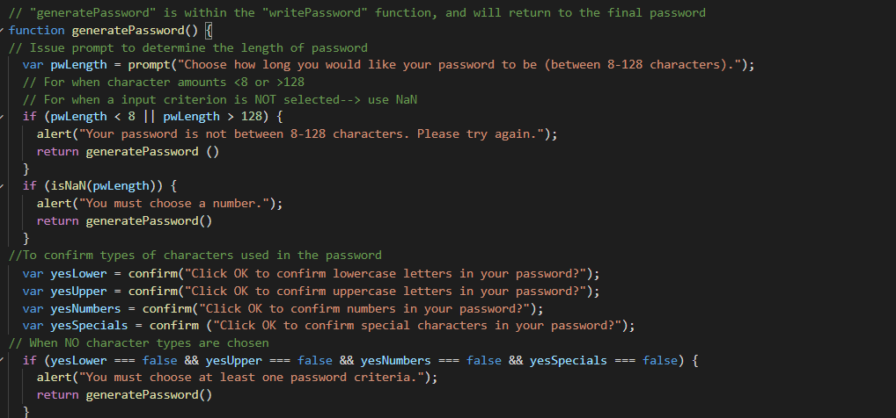
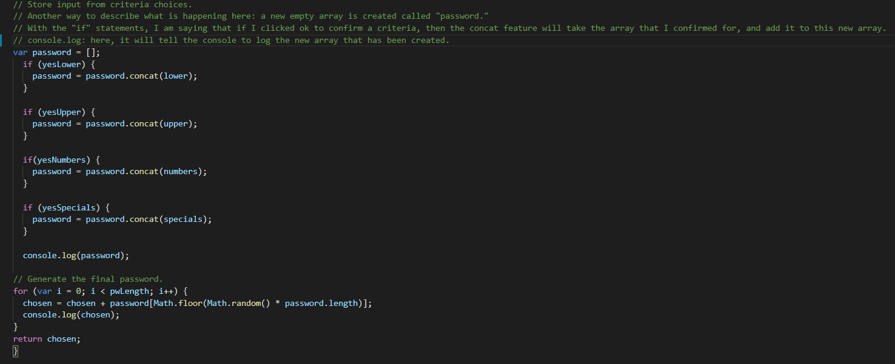

# faster-than-fast

## Description

The goal of this project is to have a webpage that will generate a random password based on a specific set of criteria. The password must select a minimum of one criteria out of four for the password to generate. The options offered for password criteria are: lowercase letters, uppercase letters, numbers, and special characters. The length of the password and the criteria for the password are presented in a series of prompts, and once all prompts have been answered, a random password will be generated, and display directly on the page. 

For this project, the main objective was to maintain the appearance of the webpage when altering the code. As such, base files which includes HTML, CSS, and JavaScript were given. In the HTML file, aside from organizing the document so that it can be read easier, no edits were done. Likewise, the CSS file was not altered. The main work occurred within the JavaScript file. Within the JavaScript file, initial code was pre-written and is denoted as given. Arrays were created to include the different criteria for the password, and a `var chosen = ""` was created to reflect the final new password. In the `function generatePassword()`, the initial prompt to the user is written as:
`var pwLength = prompt("Choose how long you would like your password to be (between 8-128 characters).")`. Following this prompt is a series of `if ()` statements that tests for different conditions when the user inputs a number for the length of characters in the password. Both `if (pwLength < 8 || pwLength > 128)` and `if (isNaN(pwLength))` are followed by alerts that prompt users to enter a number that is between 8-128 characters. A series of `confirm ()` statements are included in the JavaScript file as they are needed for the user to confirm what type of characters they want. `if ()` and `concat` are used to fill a new array based on which criteria have been selected by the user. Lastly, to generate a password that is both random and is the length that the user has picked, the following is used: 
`for (var i = 0; i < pwLength; i++) {chosen = chosen + password[Math.floor(Math.random() * password.length)];console.log(chosen);}return chosen;}`. Throughout the JavaScript files, comments were also written throughout to follow what is happening to the function step-by-step. 

[Link to webpage](https://snehitak20.github.io/faster-than-fast/)

## Technologies Used:

- HTML5
- CSS3
- JavaScript 

## Usage

To navigate this webpage, click generate password. A series of prompts will be issued in an alert window where the user can confirm the length of their password, and the types of characters they want to use. Note down the password once it has been generated and appears within the textbox. To generate a new password, refresh the webpage.

## Installation

1. Create a new repository on Github. 
    - Press the "+" sign on the top right hand corner, or the "new" button on your GitHub homepage. 
    - Create an unique name for your repository, and make the respository public. 
    - Click the "README" option to include the "README" page. 
    - Your new repository has been created.
2. Open GitBash (PC users) or Terminal (Mac users).
    - Navigate to where you want to clone your new repository onto your local machine. 
        - Use `cd` to help you navigate. 
3. To clone the new repository onto your local machine. 
    - Click the respository that you just made on github.com.
    - Click the "code" button and choose the SSH option. 
    - Copy the SSH option to your clipboard. 
    - On GitBash/Terminal, enter the command `git clone git@github.com:<UserNAME>/<demo-repo>.git`
        - After `git clone`, paste the SSH option from your clipboard into GitBash/Terminal.
        - Since the SSH option was used, enter the password for the SSH key when asked. 
4. You have now cloned your new repository.
    - Using `cd`, navigate into your new repository from the location that you have saved it in. 
    - Use `ls` to see what is inside the new repository currently. 
        - It should only include the README page as of now.
5. Tranferring the project files into your new directory on your local machine. 
    - Using Finder/Explorer, copy the corresponding files that are needed to edit your project. 
    - In another Finder/Explorer window, navigate to your new repository, and paste the files directly into that folder. 
6. On GitBash/Terminal, after pasting the project files into the new repository. 
    - Use `ls` to see what is now inside the new repository.
        - This should now include the README page, and the project files that you have copy-pasted in. 
7. Use `git status` to see if there any changes that need to be made to the repository. 
    - At this point, git will tell you that there is an untracked file .
8. Use `git add .` to add the new project files, and allow the new files to be tracked by git.
9. Use `git commit -m "add base project files"` to commit the changes have recently been made to the repository. 
10. Use `git push origin main` to sync your local machine with GitHub. 
    - Enter your SSH password when prompted. 
11. Use `code .` to open the files on a code reader of your choice.
12. Edit the files as necessary in your code reader. 
13. Periodically, and when you are finished with editing your code: 
    - Follow Steps 7-10 to keep your repository up to date with the changes that have been made. 
14. How to deploy the webpage:
    - After one final push to the repository, direct yourself to the repository's settings. 
    - Click the "pages" option from the sidebar. 
    - Select "main branch" as the source, and check that it selected for the "root" option. 
    - Click "Save" to deploy your webpage. 
    - *Give 5-10 minutes for the webpage to display the full contents.
15. You have successfully completed this project!

## Credits 

Initial code was given by the UC Berkeley Extension, Coding Bootcamp. 
## Reflection

For this project, it was important to learn the use of `prompt(), alert(), and confirm()`. It was also important to learn about the use of the `[Math.floor(Math.random())` in order to generate a random password that meets both the length and criteria that the user has selected. This project stands out because it has a functional random password generator. 

## License

Licensed under the [MIT](https://choosealicense.com/licenses/mit/#) license. 

